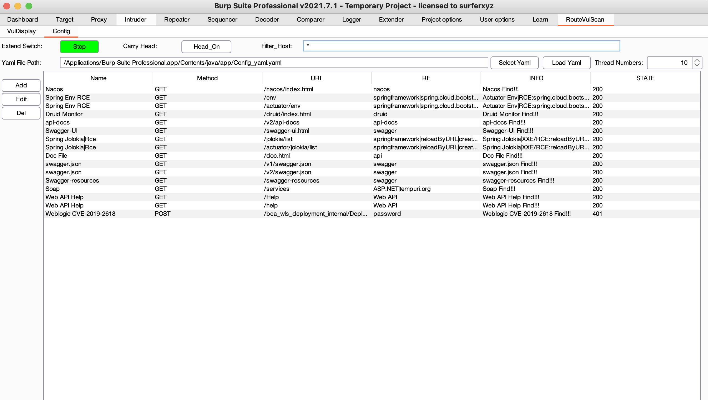
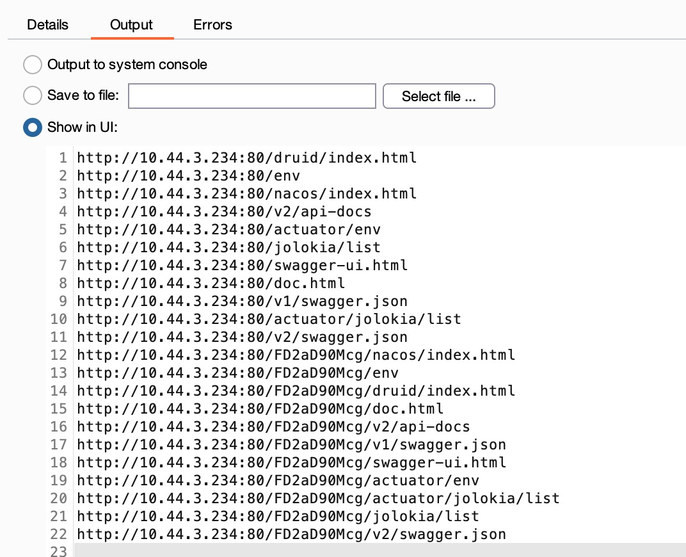

# RouteVulScan
Burpsuite - Route Vulnerable scanning  递归式被动检测脆弱路径的burp插件

***

## 合作者

[@deep0](https://github.com/deep0)

## 介绍

RouteVulScan是使用java语言基于burpsuite api开发的可以递归检测脆弱路径的burp插件。

插件可以通过被动扫描的方式，递归对每一层路径进行路径探测，并通过设定好的正则表达式匹配关键字，展示在VulDisplay界面。可以自定义相关路径、匹配信息与漏洞名称等。



访问 http://10.44.3.234/FD2aD90Mcg/login.html 探测的路径如下，可以看到RouteVulScan会对根路径，及第二层路径 /FD2aD90Mcg 探测，同理，如果有三层四层路径，都会进行探测。

探测过的url会打印在Output，如果是重复的url则不会请求，并打印在Errors。如果访问的url符合Config的规则，则会储存在VulDisplay面板进行展示。




## 使用

* 装载插件：``` Extender - Extensions - Add - Select File - Next ```
* 初次装载插件会在burpsuite当前目录下生成Config_yaml.yaml配置文件，内置11条初始规则，也可在config标签页自行加载其他yaml规则文件。
* 使用Burpsuite IScannerCheck接口，在流量初次流经burp时进行扫描，重复流量不会进行扫描。
* 使用线程池增加扫描速度，默认线程10，可自行调节。

## 更新计划

* 右键选择请求发送到插件扫描【✓】
* 域名过滤
* 批量添加规则
* UI界面增加数据包大小【✓】 
* VulDisplay界面添加删除功能【✓】
* 插件功能开关
* 带原始请求头访问
* 可自定义post/get请求

## 最后

***

### 如有正则、BUG、需求等欢迎提Issues

​	

