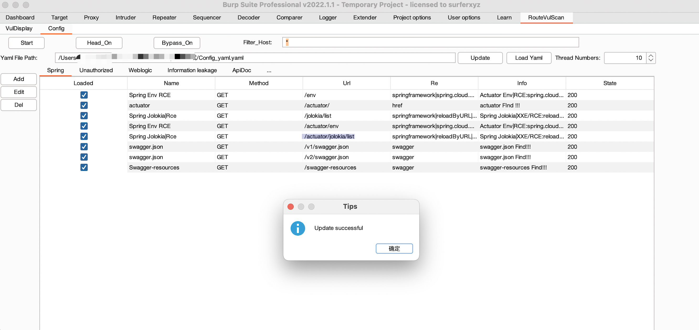

# RouteVulScan
Burpsuite - Route Vulnerable scanning  递归式被动检测脆弱路径的burp插件

***

## 贡献

* 合作者 [@deep0](https://github.com/deep0)
* 规则贡献 [@r0fus0d](https://github.com/No-Github)
* 参考项目 [HAE](https://github.com/gh0stkey/HaE)

## 介绍

RouteVulScan是使用java语言基于burpsuite api开发的可以递归检测脆弱路径的burp插件。

插件可以通过被动扫描的方式，递归对每一层路径进行路径探测，并通过设定好的正则表达式匹配响应包的关键字，展示在VulDisplay界面。可以自定义相关路径、匹配信息、与漏洞名称等。

插件重点是那些简单而有害的漏洞。这些漏洞通常不是固定路径，但可能位于路径的任何层。在这种情况下，非常容易忽视这些漏洞，而如果使用路径爆破，则非常耗时和麻烦。

所以插件主打是发送数量小、准确的payload，尽可能覆盖面广的探测一些容易忽略的漏洞。


## 使用

装载插件：``` Extender - Extensions - Add - Select File - Next ```

初次装载插件会在burpsuite当前目录下生成Config_yaml.yaml配置文件，用来储存匹配规则，该文件默认在当前burp目录下。

插件支持在线更新，点击Update按钮更新最新规则。需要注意的是，**如果你有自己添加的规则，最好先备份**，因为在线更新会直接覆盖规则文件。部分网络需要挂代理，在线更新使用的是burp网络，所以可以直接配置burp的顶级代理。



## 功能介绍

* 被动扫描，使用Burpsuite IScannerCheck接口，在流量初次流经burp时进行扫描，重复流量不会进行扫描。

  * 对流经流量的每一层路径进行规则探测，并进行正则匹配，符合规则则展示在VulDisplay界面
  * 如https://www.baidu.com/aaa/bbb，则会对/、/aaa/、/aaa/bbb/ 分别进行探测，如果存在点后缀，则会跳过。

* 使用线程池增加扫描速度，默认线程10，可自行调节（线程个数最多与规则个数相等，多了也没用）

* Start按钮，插件主开关，默认关闭

* DomainScan按钮，开启后如果host为域名，则将子域和主域当作第一层路径进行扫描。

* Head按钮，携带原始的请求头，默认关闭

* Bypass按钮，不符合预期时将配置文件中的bypass字符添加到路径中重新扫描，默认关闭

* Filter_Host 输入框，可以只扫描指定host的url，*代表全部，如 *.baidu.com

* VulDisplay界面右键可删除选中的行，或全部删除

  

* 右键请求可选择将当前请求发送到插件进行主动扫描，插件会将站点地图中，与当前请求使用一样host的历史路径全部进行扫描

  

* 可使用特殊标记获取原始请求或响应中的信息，用作请求的路径或响应。

  ```
  请求相关：
    {{request.head.*}}							-- 获取请求中head的各项，如获取cookie，{{request.head.cookie}}
    	{{request.head.host.main}}		-- 获取host的根域名，如www.baidu.com:443，则获取baidu.com
    	{{request.head.host.name}}		-- 获取域名，如www.baidu.com:443，则获取baidu
    {{request.method}}							-- 获取请求的方法，如GET/POST
    {{request.path}}								-- 获取请求的路径，如/aaa/bbb，则获取aaa/bbb
    {{request.url}}									-- 获取完整请求url
    {{request.protocol}}						-- 获取请求的协议，如http/https
    {{request.port}}								-- 获取请求的端口号
  响应相关：
    {{response.head.*}}							-- 获取响应中head的各项，如获取server，{{response.head.server}}
    {{response.status}}							-- 获取响应的状态码
  ```

* 状态码一栏可指定范围，如 200-299,500-599,302 可使用逗号来指定多个范围或多个状态码。


## 更新计划

* 2022-06-19 右键选择请求发送到插件扫描【✓】
* 2022-06-30 域名过滤【✓】
* 2022-06-19 UI界面增加数据包大小【✓】 
* 2022-06-22 VulDisplay界面添加删除功能【✓】
* 2022-06-30 插件功能开关【✓】
* 2022-06-30 带原始请求头访问【✓】
* 2022-06-30 可自定义post/get请求【✓】
* 2022-07-01 配置文件在线更新【✓】
* 2022-10-18 添加分类，提供可根据个人习惯对规则进行分类处理【✓】
* 2022-10-18 添加选择，每个规则设置为可选的形式，可自由选择想要的规则【✓】
* 2023-02-04 添加bypass规则，在正常请求不符合预期时，尝试在路径中插入bypass字符尝试绕过【✓】
* 2023-05-09 将匹配的state状态码改为可以设置范围【✓】
* 2023-05-09 添加类似模板语言的标记，可在Config中配置标记获取当前请求的各类信息并当作路径或正则【✓】

## 开心值

[](https://starchart.cc/F6JO/RouteVulScan)

## 最后

***

### 如有正则、BUG、需求等欢迎提Issues

​	

